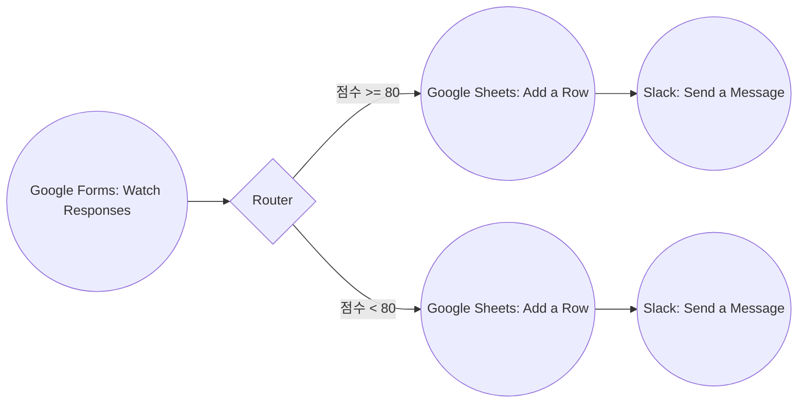
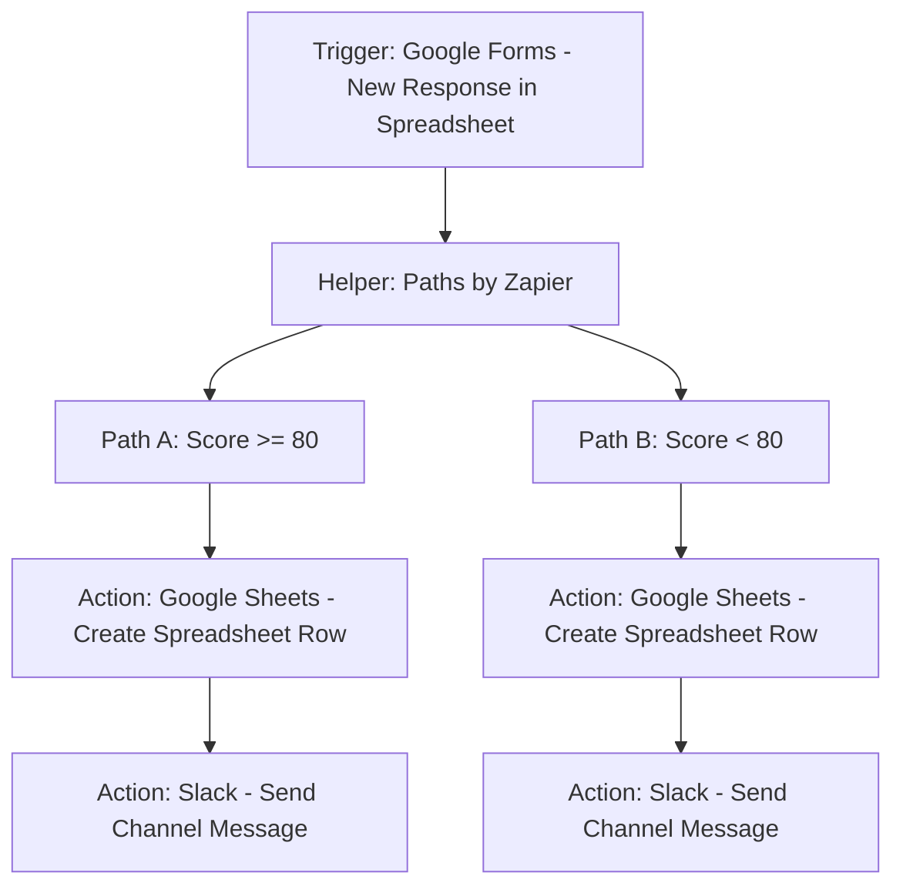

# [프로젝트 1] 자동화 도구 비교 구현 보고서 (Make vs Zapier)

이 보고서는 동일한 자동화 워크플로우를 서로 다른 2개 이상의 노코드 도구(Make, Zapier)로 구현하고 각 도구의 장단점을 상세히 비교 분석한 결과입니다.

---

## 1. 워크플로우 시나리오 정의

- **워크플로우명**: Google Forms 설문 제출에 따른 점수별 조건 분기 및 자동 알림
- **비즈니스 흐름**:
  1. **Trigger**: Google Forms에 새로운 설문 응답이 접수됨.
  2. **Router/Filter (조건 분기)**: 설문 응답 중 '만족도 점수' 필드를 검사함.
     - **조건 A**: 점수가 `80점 이상`인 경우 -> '우수 평가' 채널에 Slack 알림을 전송하고 Google Sheets '우수 고객 관리대장'에 기록.
     - **조건 B**: 점수가 `80점 미만`인 경우 -> '주의 요망' 채널에 Slack 알림을 전송하고 Google Sheets '개선 필요 명단'에 기록.

---

## 2. 도구별 구현 상세 및 실행 구조

### A. Make 구현 명세

#### 워크플로우 구성 (Scenario Editor)
Make는 캔버스 위에 노드(Module)들을 동그라미 형태로 배치하고 이들을 선(Connection)으로 연결하여 워크플로우를 구성합니다.

#### 설정 값 (Configuration)
1. **Trigger Module**: `Google Forms - Watch Responses`
   - Connection: Google Account Link (OAuth 2.0)
   - Form ID: `고객 만족도 조사 피드백`
   - Limit: `1` (실시간 감지 주기별 1개씩 처리)
2. **Router**: 조건 필터 설정
   - **Route 1**: `점수` (Numeric operator) `Greater than or equal to` `80`
   - **Route 2**: `점수` (Numeric operator) `Less than` `80`
3. **Action Module 1 (우수)**: `Google Sheets - Add a Row`
   - Spreadsheet: `만족도_평가_결과지`
   - Sheet Name: `우수_고객`
   - Values:
     - 이름: `{{1.Response.Name}}`
     - 이메일: `{{1.Response.Email}}`
     - 점수: `{{1.Response.Score}}`
4. **Action Module 2 (우수)**: `Slack - Create a Message`
   - Channel: `#feedback-good`
   - Text: `:star: 우수 평가 등록! 고객명: {{1.Response.Name}} ({{1.Response.Score}}점)`

---

### B. Zapier 구현 명세

#### 워크플로우 구성 (Zaps)
Zapier는 위에서 아래로 흐르는 단선형(Linear) 리스트 구조로 단계를 지정합니다. Multi-path(조건 분기)를 위해 **Paths by Zapier** 헬퍼 앱을 사용합니다.

#### 설정 값 (Configuration)
1. **Trigger Step**: `Google Forms - New Response in Spreadsheet`
   - Form: `고객 만족도 조사 피드백`
2. **Paths Step**: `Paths by Zapier`
   - **Path A Rules**: Only continue if `Score` `(Number) Greater than` `79`
   - **Path B Rules**: Only continue if `Score` `(Number) Less than` `80`
3. **Action Step (Path A)**: `Google Sheets - Create Spreadsheet Row`
   - Spreadsheet: `만족도_평가_결과지`
   - Sheet: `우수_고객`
4. **Action Step (Path A)**: `Slack - Send Channel Message`
   - Channel: `#feedback-good`
   - Message: `[Zapier] 우수 평가 등록 - {{Name}} ({{Score}}점)`

---

## 3. 실행 결과 데이터 비교

동일한 테스트 데이터를 입력하여 두 자동화 도구의 조건 분기가 올바르게 작동했는지 확인한 로그 예시입니다.

### 테스트 입력 데이터
- **Case 1**: 홍길동, `hong***@gmail.com`, 점수: `95점` (Route A / Path A로 분기되어야 함)
- **Case 2**: 김철수, `kim***@naver.com`, 점수: `60점` (Route B / Path B로 분기되어야 함)

### 실행 결과 로그 (Execution Log)

#### 1) Make 실행 로그 (History)
- **Case 1 실행 (95점)**:
  - `Google Forms [1]` 모듈에서 응답 감지 (Score: 95)
  - `Router` 도달 후 `Route 1` 필터 통과 (95 >= 80 -> True), `Route 2` 필터 탈락 (95 < 80 -> False)
  - `Google Sheets - Add a Row [우수_고객]` 실행 성공 (Status Code: 200)
  - `Slack - Create a Message [#feedback-good]` 전송 완료 (Status Code: 200)
- **Case 2 실행 (60점)**:
  - `Google Forms [1]` 모듈에서 응답 감지 (Score: 60)
  - `Router` 도달 후 `Route 1` 필터 탈락 (60 >= 80 -> False), `Route 2` 필터 통과 (60 < 80 -> True)
  - `Google Sheets - Add a Row [개선_필요]` 실행 성공 (Status Code: 200)
  - `Slack - Create a Message [#feedback-bad]` 전송 완료 (Status Code: 200)

#### 2) Zapier 실행 로그 (Zap History)
- **Case 1 실행 (95점)**:
  - Trigger `New Response` 수신
  - Path A 실행: Filter (95 > 79) = True -> Google Sheets 로우 생성 완료 -> Slack 채널 `#feedback-good` 메시지 전송 성공
  - Path B 실행: Filter (95 < 80) = False -> 실행 중단 (Task consumed: 0)
- **Case 2 실행 (60점)**:
  - Trigger `New Response` 수신
  - Path A 실행: Filter (60 > 79) = False -> 실행 중단 (Task consumed: 0)
  - Path B 실행: Filter (60 < 80) = True -> Google Sheets 로우 생성 완료 -> Slack 채널 `#feedback-bad` 메시지 전송 성공

---

## 4. Make vs Zapier 상세 비교 분석

| 비교 항목 | Make (구 Integromat) | Zapier |
| :--- | :--- | :--- |
| **1) UI/UX 방식** | 시각적 드래그 앤 드롭 캔버스 형식. 복잡한 다중 분기 및 루프 흐름을 지도 형태로 한눈에 파악 가능. | 수직적 리스트 형식. 순차적인 단계별 설정이 쉬우나 복잡한 분기는 직관성이 다소 떨어짐. |
| **2) 설정 난이도** | 초기 학습 곡선이 있음. 데이터 매핑 및 데이터 타입(Array, Collection) 처리에 대한 지식이 일부 요구됨. | 매우 직관적이고 쉬움. 초보자도 5분 이내에 첫 자동화를 구축할 수 있을 정도로 사용자 친화적임. |
| **3) 연동 서비스 범위** | 대다수의 글로벌 주요 서비스 연동 제공. 다만 일부 틈새 국산 앱의 커넥터는 부족할 수 있음. | 업계 최대 규모의 서드파티 앱 연동 생태계 보유. 거의 모든 웹 서비스의 커넥터가 이미 내장되어 있음. |
| **4) 무료 플랜 범위** | **매우 넉넉함**: 월 1,000 Ops 무료. 다중 단계(Multi-step) 및 조건 분기(Router)도 무료 플랜에서 무제한 사용 가능. | **매우 제한적**: 월 100 Tasks 무료. 3단계 이상의 Multi-step이나 조건 분기(Paths) 기능은 유료 플랜 필수. |
| **5) 실행 로그 확인** | 실행 히스토리에서 각 모듈의 입력/출력 JSON 데이터를 노드별로 시각적으로 확인 및 디버깅 가능. | 단계별 텍스트 로그 형태로 확인 가능하며 디버깅 기능이 직관적이나 데이터 세부 조회는 덜 자유로움. |

---

## 5. 결론 및 종합 의견

- **장단점 요약**:
  - **Make**: 저렴한 비용(무료 플랜 범위가 큼)으로 고성능/다중 분기 자동화를 구현하기에 최적입니다. 복잡한 비즈니스 로직(반복문, 데이터 포맷 변경 등)을 다루기 용이합니다.
  - **Zapier**: 비전문가도 가장 빠르게 비즈니스 프로세스를 자동화할 수 있는 강력한 접근성을 가지고 있습니다. 단, 조금만 복잡해져도 유료 플랜 결제가 강제되는 단점이 있습니다.

- **추천 상황**:
  - **스타트업 / 개인 개발자**: 비용을 최소화하면서 복잡한 파이프라인(Filter, Router 등)을 마음껏 구성해야 한다면 **Make**를 강력히 권장합니다.
  - **일반 비즈니스 부서 / 비개발 협업팀**: 빠른 셋업과 넓은 연동 범위가 중요하고, 간단한 자동화 위주로 구성하며 예산적 여유가 있다면 **Zapier**가 더 우수한 선택이 됩니다.
