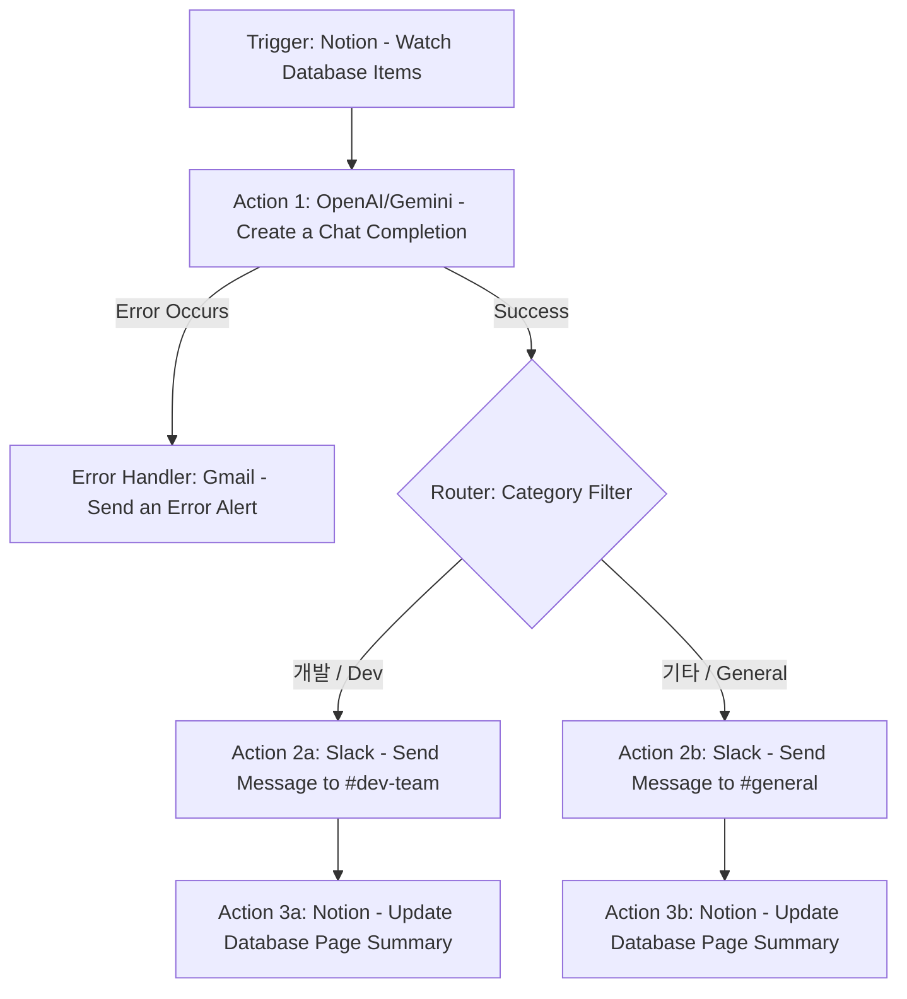

# [프로젝트 2] 자유 주제 자동화 설계 및 구현 보고서

본 프로젝트는 실무에서 자주 발생하는 **'회의록/아이디어 노트 수집 후 핵심 내용 요약 및 담당 채널 알림'** 업무를 노코드 툴(Make)과 LLM API(AI 연동), 그리고 예외 처리(실패 알림) 구조를 결합해 자동화한 사례입니다.

---

## 1. 반복 업무 정의 및 자동화 목표

- **업무 명칭**: Notion 회의록 데이터베이스 자동 요약 및 부서별 Slack 전파
- **기존 수작업 프로세스**:
  1. 회의가 끝난 후 Notion 데이터베이스에 새로운 회의록 페이지를 생성함.
  2. 회의록 내용을 복사해 ChatGPT 등의 AI 도구에 넣고 요약본을 받아옴.
  3. 요약된 내용을 확인하고, 회의 주제(개발, 디자인, 마케팅 등)에 맞는 Slack 채널을 찾아 직접 붙여넣음.
- **자동화 목표**:
  - Notion에 새 회의록이 생성되면 **수동 개입 없이** AI가 자동으로 핵심 요약 및 카테고리를 판단함.
  - 카테고리별로 지정된 Slack 채널로 알림을 라우팅하여 전송함.
  - 외부 서비스 API 호출 장애 등 예외 발생 시 담당자에게 즉시 메일 알림을 보냄.

---

## 2. 도구 선정 및 이유

- **선정 도구**: **Make (구 Integromat)**
- **선정 이유**:
  1. **고성능 조건 분기(Router)**: 카테고리 및 우선순위에 따른 복잡한 다중 분기 경로를 무료 플랜 내에서 시각적으로 유연하게 설계 가능.
  2. **상세한 에러 핸들링**: 모듈별로 에러가 발생했을 때 이를 캐치하여 다른 경로(Gmail 발송 등)로 우회 처리할 수 있는 `Error Handler Route` 기능 제공.
  3. **데이터 매핑 제어**: JSON 파싱 및 데이터 변환 기능이 강력하여 LLM 응답을 받아 파싱하기 용이함.

---

## 3. 워크플로우 설계 다이어그램 (Workflow Diagram)



---

## 4. 단계별 상세 설정 및 데이터 규격 (Input / Output)

### Step 1: Trigger (Notion - Watch Database Items)
- **설정**: Notion 워크스페이스의 `[회의록 대장]` 데이터베이스에 새 페이지가 생성 및 수정되는지 15분 주기로 감지.
- **Output 데이터 규격 (예시)**:
  ```json
  {
    "pageId": "notion-page-uuid-1234",
    "title": "2026-06-11 신규 결제 시스템 아키텍처 회의록",
    "creator": "Jang",
    "content": "신규 결제 시스템 도입을 위한 데이터베이스 구조 설계. 트랜잭션 보장 전략 및 API 타임아웃 3초 설정 조율. 개발 기한은 6월 말까지 완료 목표."
  }
  ```

### Step 2: Action 1 (OpenAI/Gemini - Create a Chat Completion)
- **역할**: 회의록 본문을 분석하여 `요약문`과 `카테고리(개발/기타)`를 분류함.
- **프롬프트 설정**:
  - **System Prompt**: `You are a helpful assistant. Summarize the meetings and classify them into either "개발" or "기타" in JSON format: {"summary": "...", "category": "개발" or "기타"}`
  - **User Prompt**: `회의록 내용: {{Step1.content}}`
- **Output 데이터 규격**:
  ```json
  {
    "summary": "신규 결제 시스템의 아키텍처 설계 회의로, 트랜잭션 보장 및 3초 API 타임아웃 설정을 6월 말까지 완료하기로 결정함.",
    "category": "개발"
  }
  ```

### Step 3: Router (조건 분기) 및 Action 2 (Slack 전송)
- **분기 규칙 1 (개발)**: `{{Step2.category}}` 가 `개발`과 같음 (Equal to)
  - **Action**: `Slack - Send a Message` -> `#dev-team` 채널 전송
- **분기 규칙 2 (기타)**: `{{Step2.category}}` 가 `개발`과 다름 (Not equal to)
  - **Action**: `Slack - Send a Message` -> `#general` 채널 전송

### Step 4: Action 3 (Notion - Update Database Page)
- **역할**: 생성된 요약본을 원래 Notion 페이지의 `요약(Summary)` 속성 필드에 자동으로 채워 기록 보존.

---

## 5. 실패 대응 및 재시도 전략 (Error Handling)

- **설계 의도**: LLM API 서버가 다운되거나 할당량이 초과되는 오류(`429/500 Error`) 발생 시, 워크플로우가 그냥 중단되는 대신 에러를 수집하여 담당자에게 알림을 보냄.
- **구현 방식**:
  - OpenAI/Gemini 모듈에 **'Add Error Handler'** 노드를 추가하고 `Gmail - Send an Email` 모듈을 연결.
  - 오류 발생 시, 담당자 메일(`jang***@company.com`)로 `[자동화 에러 발생] Notion 요약 모듈 실패 알림` 제목의 메일을 발송함.
  - 에러 메시지(`{{error.message}}`)와 실패한 Notion `pageId`를 동적으로 포함하여 빠른 복구 가능하도록 설계.

---

## 6. 실제 동작 및 테스트 실행 로그 (Execution Log)

### 테스트 1: 정상 분류 및 전송 (개발 카테고리)
- **Trigger**: Notion에 새 페이지 생성 (제목: "결제 모듈 리팩토링 및 API 타임아웃 설정")
- **AI 분석 결과**:
  - Category: `개발`
  - Summary: `API 타임아웃 3초 설정 조율 및 데이터베이스 리팩토링 방향성 확립`
- **Router 통과 결과**: `개발` 조건 필터 통과 -> Slack `#dev-team` 채널에 성공 메시지 발송 완료 및 Notion 업데이트 성공.

### 테스트 2: 예외 처리 (에러 핸들러 발동)
- **상황**: AI API Key 제한/네트워크 끊김 상태 유도.
- **동작**:
  - Notion Trigger 정상 감지.
  - LLM 모듈 호출 중 `API Connection Error (500)` 발생.
  - Make의 **Error Handler Route**에 지정된 Gmail 모듈이 작동.
  - 담당자 이메일로 아래와 같이 에러 세부 정보가 전송됨:
    - *제목*: `[Make Error Alert] Notion 자동화 요약 실패`
    - *본문*: `Notion Page ID: notion-page-uuid-1234 에서 에러 발생. 에러코드: 500. 세부메시지: Failed to resolve host.`
  - 워크플로우는 정상적으로 복구/종료되어 흐름 차단 방지.
