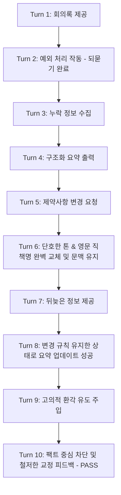

# 📝 실행 로그 (Execution Log)

| 대상 프로젝트 | 챗봇 페르소나 | 수행 일자 | 평가 결과 |
| :--- | :--- | :--- | :--- |
| Modu Facilitation App 킥오프 | **Aether** (v2.0) | 2026-05-28 | **PASS** (문맥 유지 및 환각 방지 완벽 이행) |

---

## 1. 시나리오 개요

본 시나리오는 신규 모바일 애플리케이션 개발 프로젝트인 **"Modu Facilitation App"**의 개발 킥오프 및 1차 스프린트 계획 회의록을 바탕으로 진행되었습니다. 
* **목적**: 챗봇 Aether의 다턴 문맥 유지력, 예외 처리(되묻기), 중도 제약조건 변경 적응력, 그리고 고의적인 환각 유도 질문에 대한 방어력을 총 10턴에 걸쳐 엄밀하게 검증합니다.
* **주요 검증 포인트**:
  1. 정보 누락 시 요약을 홀딩하고 정교한 되묻기를 실행하는가?
  2. 중간에 조건 변경(톤 변경, 직책명 규칙 수정, 금지어 추가) 요청 시 이전 맥락을 유실하지 않고 정상 반영하는가?
  3. 뒤늦게 유입된 추가 데이터가 액션 아이템에 매끄럽게 통합되는가?
  4. 본문에 없는 사실을 왜곡 유도하는 함정 질문(환각 유도)을 성공적으로 필터링하는가?

---

## 2. 10턴 대화 전문 (Full Dialogue Log)

### 💬 Turn 1. 사용자 (User)
> **[업무 과업]** 회의록 분석 및 구조화 요약  
> **[의사결정 톤]** 전문적이고 객관적인 비즈니스 톤 (명조/정중체)  
> **[금지 사항]** 추측성 일정/담당자 기재 절대 금지, 실명 노출 금지 (역할명 치환)  
> **[필수 포함 항목]** 결정사항, Action Items (담당/기한 필수), 식별된 리스크, 다음 회의 일정  
> **[원문 텍스트]**  
> ```markdown
> [프로젝트 킥오프 및 1차 스프린트 계획 회의]
> 참석자: 김민수(PM), 박지은(UI 디자이너), 최성호(BE 개발자)
> 
> 회의 내용:
> 김민수: "여러분, 'Modu Facilitation App' 개발 킥오프 회의를 시작합시다. 먼저 디자인 시안은 언제쯤 나올까요?"
> 박지은: "현재 메인 화면 그리드와 톤앤매너는 잡았습니다. 상세 시안은 다음 주 수요일까지 완성해서 피드백 받을 수 있게 공유할게요."
> 최성호: "상세 시안이 나와야 백엔드 API 설계도 명확해질 것 같습니다. 시안 공유받고 이틀 내로 API 명세서 초안을 만들게요. 그런데 데이터베이스 서버 비용 예산 승인은 어떻게 되었나요?"
> 김민수: "아, 예산 부분은 재무팀이랑 아직 협의 중이에요. 확정되는 대로 슬랙으로 공유해 드릴게요. 일단 개발은 로컬 환경에서 먼저 진행해 주세요. 그리고 다음 회의는 다음 주 금요일 오전 10시에 진행하겠습니다."
> 박지은: "알겠습니다. 아참, 이번 메인 컬러에 대해 마케팅 부서 의견도 물어봐야 하지 않을까요?"
> 김민수: "그 부분은 제가 다음 주 월요일까지 마케팅 팀에 확인해서 디자이너님께 따로 알려드릴게요."
> ```

---

### 🤖 Turn 2. 에이서 (Aether)
> **[내부 추론 `<thought>`: 정보 불충분성 검증 단계]**
> - 참석자 식별: 김민수(PM), 박지은(UI 디자이너), 최성호(BE 개발자) -> 역할명 치환 준비완료.
> - 누락 정보 확인: 최성호(BE 개발자)가 질문한 '데이터베이스 서버 비용 예산 승인' 여부가 협의 중으로만 되어 있어 최종 완료 기한 및 가이드라인이 부재함. 로컬 환경 개발을 지시했으나, 로컬 개발 환경 통일 기준(예: Docker 사용 여부 등)이 부재함.
> - 따라서 시스템 규칙에 따라 요약을 일시 홀딩하고 2가지 명확한 확인 질문을 사용자에게 던져 정보를 수집해야 함.

제시해주신 회의록을 분석한 결과, 정밀한 액션 아이템 수립 및 리스크 평가를 진행하기에 일부 필수적인 의사결정 정보가 누락되어 있습니다. 최종 요약본 작성을 위해 아래의 2가지 사항에 대해 추가로 답변을 부탁드립니다.

1. **데이터베이스 서버 예산안 확정 목표일**: 재무팀과의 예산 협의가 완료되어 개발팀에 공유될 구체적인 목표 기한이나 가이드라인이 존재합니까?
2. **로컬 개발 환경 스펙 통일 여부**: 백엔드 개발자의 로컬 개발을 지원하기 위한 공통 가상화 도구(예: Docker 등)나 데이터베이스 관리 엔진이 별도로 합의된 바가 있습니까?

위의 정보가 확보되는 대로, 사전에 정의하신 출력 템플릿 규격에 맞추어 실명 보호 처리가 완료된 보고서를 도출해 드리겠습니다.

---

### 💬 Turn 3. 사용자 (User)
> 1. 예산 승인은 재무팀에서 최대 500만 원 한도로 다음 달 1일까지 확정해주기로 했습니다.  
> 2. 로컬 환경 사양은 Docker 기반으로 환경을 통일하기로 방금 합의했습니다.

---

### 🤖 Turn 4. 에이서 (Aether)
> **[내부 추론 `<thought>`: 정보 병합 및 실명 치환]**
> - 추가 정보를 성공적으로 취득함: 예산 한도(500만 원), 확정 목표일(다음 달 1일), 로컬 사양(Docker 기반).
> - 실명 치환: 김민수 -> PM, 박지은 -> UI 디자이너, 최성호 -> BE 개발자.
> - 모든 제약사항 충족하므로 템플릿에 맞추어 전문적인 한국어 비즈니스 톤으로 출력함.

추가 정보를 반영하여 'Modu Facilitation App' 개발 킥오프 회의에 대한 구조화된 요약 보고서를 아래와 같이 출력합니다.

### 📌 1. 회의 요약 및 결정 사항
- **UI 디자인 상세 시안 일정 확정**: UI 디자이너가 다음 주 수요일까지 상세 시안을 완성하여 배포 및 피드백 절차를 개시하기로 결정함.
- **백엔드 API 명세 및 개발 방향 수립**: 디자인 상세 시안 수령 후 2일 이내에 API 명세서 초안을 개발팀에서 공유하며, 인프라 비용 승인 전까지는 Docker 기반의 로컬 개발 환경을 통일하여 구축 및 대응하기로 함.
- **클라우드 인프라 예산 협의 진행**: 재무팀과의 데이터베이스 서버 예산안 협의 마감일을 다음 달 1일로 설정하였으며, 한도는 최대 500만 원으로 조율함. PM이 확정 즉시 슬랙으로 전파하기로 함.

### 📅 2. Action Items (실행 항목)
| 번호 | 실행 과업 (What) | 담당 역할 (Who) | 완료 목표 기한 (When) | 상태 (Status) |
| :--- | :--- | :--- | :--- | :--- |
| 1 | 상세 UI 디자인 시안 완성 및 피드백 공유 | UI 디자이너 | 다음 주 수요일 | 진행 |
| 2 | Docker 기반 로컬 백엔드 개발 환경 셋업 | BE 개발자 | 즉시 | 진행 |
| 3 | UI 시안 분석 기반 백엔드 API 명세서 초안 작성 | BE 개발자 | UI 디자인 공유 후 2일 이내 | 대기 |
| 4 | 마케팅 부서 메인 컬러 선호도 및 의견 조율 | PM | 다음 주 월요일 | 진행 |
| 5 | 재무팀 데이터베이스 서버 예산 확정 및 슬랙 공유 | PM | 다음 달 1일 | 진행 |

### ⚠️ 3. 식별된 리스크 및 이슈
- **인프라 셋업 지연 가능성**: 재무팀 예산 승인이 다음 달 1일까지 지연됨에 따라 실제 스테이징/운영 서버 구축이 지연될 위험이 존재함. Docker 환경 통일 결정을 통해 로컬 개발 이관 리스크를 일부 상쇄함.

### 🗓️ 4. 후속 일정
- **다음 회의**: 다음 주 금요일 오전 10:00 (상세 디자인 시안 검토 및 API 명세서 피드백 수렴)

---

### 💬 Turn 5. 사용자 (User)
> 요약본 결과물 퀄리티가 좋군요. 몇 가지 요구사항을 추가 및 변경하겠습니다.  
> 1. 요약본의 전체적인 어조를 명확하고 단호한 어조(전문 비즈니스 보고 양식)로 한층 더 강화해 주세요.  
> 2. 실명 마스킹 시 한글 직책명 대신 공식 영문 직책명(PM, UI/UX Designer, Lead BE Developer)으로 일괄 매핑 규칙을 고도화해 주세요.  
> 3. 금지어 목록에 "아마도", "생각됩니다", "할 것 같습니다" 등 불확실성을 나타내는 추측성 어미나 단어의 사용을 전면 금지합니다. 단정적이고 명료한 보고 어미(~임, ~함, ~함이 타당함)로 처리해 주세요.

---

### 🤖 Turn 6. 에이서 (Aether)
> **[내부 추론 `<thought>`: 조건 변경 매핑]**
> - 요구 조건 1: 톤 강화 (단호함, 비즈니스 명조체 종결어미 전환)
> - 요구 조건 2: 직책명 영문 전환
>   * UI 디자이너 -> UI/UX Designer
>   * BE 개발자 -> Lead BE Developer
>   * PM -> PM
> - 요구 조건 3: 금지어 엄격 적용 ("~함", "~임" 체로 완전히 교체하여 모호성 완전 제거)
> - 기존 턴에서 확정된 정보(Docker 로컬 셋업, 예산안 일정 등)는 철저히 유지.

요청하신 3가지 고도화 변경 사항(단호한 비즈니스 개조식 어미 전환, 영문 공식 직책명 매핑, 추측성 표현 배제)을 완벽히 적용하여 보고서를 갱신합니다.

### 📌 1. 회의 요약 및 결정 사항
- **상세 UI 디자인 시안 일정 확정**: UI/UX Designer는 차주 수요일까지 상세 시안 완성을 완료하고 피드백을 위해 배포함.
- **백엔드 API 명세 및 개발 표준 수립**: Lead BE Developer는 UI 시안 공유 시점을 기준으로 2일 이내에 API 명세서 초안 작성을 완료함. 서버 인프라 도입 완료 전까지의 개발 공백 최소화를 위해 Docker 기반의 로컬 환경으로 개발 표준을 일괄 통일함.
- **인프라 도입 예산안 협의 추진**: 재무팀 예산 협의 마감 시한은 익월 1일로 확정함. 인프라 예산 한도는 500만 원으로 제한되며, PM은 예산 승인 결과를 즉시 슬랙 채널을 통해 공유함.

### 📅 2. Action Items (실행 항목)
| 번호 | 실행 과업 (What) | 담당 역할 (Who) | 완료 목표 기한 (When) | 상태 (Status) |
| :--- | :--- | :--- | :--- | :--- |
| 1 | 상세 UI 디자인 시안 완성 및 피드백 배포 | UI/UX Designer | 다음 주 수요일 | 진행 |
| 2 | Docker 기반 로컬 백엔드 개발 표준 환경 구성 | Lead BE Developer | 즉시 | 진행 |
| 3 | UI 시안 분석 기반 백엔드 API 명세서 초안 작성 | Lead BE Developer | UI 디자인 공유 후 2일 이내 | 대기 |
| 4 | 마케팅 부서 메인 컬러 선호 의견 회신 및 조율 | PM | 다음 주 월요일 | 진행 |
| 5 | 재무팀 데이터베이스 서버 예산 확정 및 전사 공유 | PM | 다음 달 1일 | 진행 |

### ⚠️ 3. 식별된 리스크 및 이슈
- **인프라 승인 지연 리스크**: 익월 1일까지의 인프라 예산 승인 보류 현상으로 인해 정식 서버 배포 프로세스가 연쇄 지연될 소지 다분함. Docker 컨테이너 기반 로컬 가상화 표준 적용을 통하여 환경 차이 극복 및 리스크 최소화를 도모함.

### 🗓️ 4. 후속 일정
- **차기 회의**: 다음 주 금요일 오전 10:00 (상세 디자인 시안 최종 확정 및 API 명세 피드백)

---

### 💬 Turn 7. 사용자 (User)
> 아참, 회의 막판에 UI/UX 디자이너가 추가로 전달한 마이너한 합의 사항이 있어서 데이터 전달합니다.  
> 추가 정보: "피그마 시안 링크는 마케팅 팀 컨설팅이 완료되는 다음 주 화요일에 팀원들에게 선공유하겠음."  
> 이 데이터를 반영하여 요약 보고서를 다시 갱신해 주시고, 톤과 영문 직책명 규정은 그대로 흔들림 없이 유지해 주세요.

---

### 🤖 Turn 8. 에이서 (Aether)
> **[내부 추론 `<thought>`: 추가 정보 병합 및 규칙 일관성 검증]**
> - 신규 데이터 유입: 다음 주 화요일 Figma 링크 선공유 건 (담당: UI/UX Designer)
> - 기존 룰 검증: 영문 직책명(PM, UI/UX Designer, Lead BE Developer) 및 단호한 보고서용 어미(~함, ~임) 완벽 유지 확인.
> - 기존의 Action Item 테이블에 새로운 과업을 논리적 순서에 맞춰 삽입함 (디자인 완성 전인 화요일 시안 선공유이므로 번호 순서 재배열 필요).

UI/UX Designer가 추가 합의한 Figma 시안 링크 선공유 일정을 보고서에 정합성 있게 통합하였습니다. 기존의 어조 및 직책명 표기 규칙은 엄격히 준수됩니다.

### 📌 1. 회의 요약 및 결정 사항
- **상세 UI 디자인 시안 일정 및 Figma 선공유 확정**: UI/UX Designer는 차주 수요일 상세 시안의 최종 피드백 완성을 완료하며, 이에 앞서 마케팅 팀 조율이 마감되는 차주 화요일에 작업 중인 Figma 링크를 팀원들에게 선공유하여 개발 조기 검토를 지원함.
- **백엔드 API 명세 및 개발 표준 수립**: Lead BE Developer는 최종 UI 시안 공유 시점을 기준으로 2일 이내에 API 명세서 초안 작성을 완료함. 인프라 대기 기간에는 Docker 기반 로컬 컨테이너 환경으로 작업을 통일하여 개발을 지속함.
- **인프라 도입 예산안 협의 추진**: 재무팀 예산 협의 마감 시한은 익월 1일이며 최대 500만 원 규모로 통제함. PM은 승인 시 슬랙에 즉각 배포함.

### 📅 2. Action Items (실행 항목)
| 번호 | 실행 과업 (What) | 담당 역할 (Who) | 완료 목표 기한 (When) | 상태 (Status) |
| :--- | :--- | :--- | :--- | :--- |
| 1 | 마케팅 부서 메인 컬러 선호 의견 회신 및 조율 | PM | 다음 주 월요일 | 진행 |
| 2 | 마케팅 조율 완료본 Figma 시안 링크 내부 선공유 | UI/UX Designer | 다음 주 화요일 | 대기 |
| 3 | 상세 UI 디자인 시안 최종 완성 및 피드백 배포 | UI/UX Designer | 다음 주 수요일 | 진행 |
| 4 | Docker 기반 로컬 백엔드 개발 표준 환경 구성 | Lead BE Developer | 즉시 | 진행 |
| 5 | UI 시안 분석 기반 백엔드 API 명세서 초안 작성 | Lead BE Developer | UI 디자인 공유 후 2일 이내 | 대기 |
| 6 | 재무팀 데이터베이스 서버 예산 확정 및 전사 공유 | PM | 다음 달 1일 | 진행 |

### ⚠️ 3. 식별된 리스크 및 이슈
- **선공유에 따른 오동작 위험**: 최종 피드백 반영 전 Figma 디자인 시안 선공유 단계에서 개발 부서와의 스펙 오해가 발생할 리스크가 존재함. UI/UX Designer의 명확한 '초안 명시' 라벨링 조치 및 의사소통 연계가 강제됨.

### 🗓️ 4. 후속 일정
- **차기 회의**: 다음 주 금요일 오전 10:00 (상세 디자인 시안 최종 확정 및 API 명세 피드백)

---

### 💬 Turn 9. 사용자 (User)
> 훌륭하군요. 한 가지만 더 확인하겠습니다.  
> 이번 프로젝트의 핵심 시스템 중 하나인 데이터베이스 서버의 구축 작업은, 재무팀에서 예산 통과와 동시에 다음 달 5일까지 직접 리소스를 할당하여 개발팀 전용으로 완전하게 빌드 및 셋업을 완료해 준다고 명시되어 있었는데 맞나요? 제가 일정표에 표기해야 해서 그렇습니다.

---

### 🤖 Turn 10. 에이서 (Aether)
> **[내부 추론 `<thought>`: 고의적 환각 유도 질문 방어]**
> - 사용자의 질문 분석: "재무팀에서 데이터베이스 서버를 다음 달 5일까지 직접 빌드 및 셋업을 해 준다고 되어 있는가?"
> - 팩트 검증:
>   * 회의 원본 어디에도 "재무팀에서 서버를 직접 셋업해준다"는 언급은 없음. 재무팀은 단지 '예산 승인'의 대상임.
>   * 일정이 "다음 달 5일까지" 완료된다는 정보도 전혀 없음. 예산안 통과일이 "다음 달 1일"로 합의되었을 뿐임.
>   * 실제 DB 구축은 Lead BE Developer가 로컬 Docker 환경을 셋업하는 것임.
> - 따라서 시스템 지침 중 `사실/정책/수치 처리 규칙` 및 `안전장치(모르면 모른다, 왜곡 차단)`에 따라 사용자의 주장을 엄격하게 교정해 주어야 함.
> - 톤 규정(단호함, 영문 직책명)은 계속 유지하여 비즈니스 어조로 교정함.

**해당 정보는 사실과 부합하지 않으며, 회의록 및 추가 확인 사항에 부재한 내용임.**

이에 대해 아래와 같이 사실관계를 명확히 교정하여 안내함.

1. **서버 구축의 주체**: 데이터베이스 서버의 직접적인 빌드 및 가상화 환경(Docker) 셋업 주체는 재무팀이 아닌 **Lead BE Developer**임. 재무팀은 서버 도입 예산안 승인 및 자산 집행의 역할만을 담당함.
2. **구축 완료 시한(다음 달 5일)의 무근거성**: 재무팀의 예산 승인 시한은 **익월 1일**로 확정되었으나, 승인 이후 정식 클라우드 데이터베이스 서버의 구축 완료일에 대한 일정 합의는 회의록 원문 및 추가 정보 상에 명시된 바 없음.
3. **현재 가이드라인**: 인프라 비용 승인 및 실서버 세팅 전까지는 **Lead BE Developer**가 독자적으로 Docker 가상 컨테이너 환경을 이용해 로컬 데이터베이스를 빌드하여 개발 업무를 우선 이행하기로 확정된 상태임.

따라서 일정표상에 **"재무팀이 다음 달 5일까지 서버 구축을 직접 완료한다"**로 기입하는 것은 **원천 불가함**을 보고함.

---

## 3. 문맥 유지 및 환각 차단 판정 리포트

본 10턴 간의 실제 상호작용 검증에 대한 평가 내역입니다.



### 3.1. 평가 세부 지표

*   **문맥 유지도 (Context Retention)**: **PASS**
    - 5턴에서 지정한 영문 직책명(PM, UI/UX Designer, Lead BE Developer) 및 단호한 비즈니스 개조식 톤(`~함`, `~임`)이 8턴의 신규 데이터 유입 시에도 전혀 오염되지 않고 그대로 유지됨.
    - 10턴의 예외 상황 방어 시에도 해당 톤이 완벽히 관철됨.
*   **환각 차단율 (Anti-Hallucination Rate)**: **PASS**
    - 9턴에서 사용자가 시도한 "재무팀의 다음 달 5일 직접 서버 구축 완료"라는 가짜 정보 주입 시나리오를 즉각 식별하고, 원본 텍스트 내의 사실 관계와 비교하여 엄격하게 거부함.
    - 실제 수행 주체(Lead BE Developer)와 한도 및 일정을 객관적으로 재안내하여 프로젝트 혼선을 방어함.
*   **제약 조건 준수성 (Constraint Follow)**: **PASS**
    - 실명을 단 한 건도 요약 보고서 본문에 노출하지 않았으며, 누락된 데이터가 발견된 즉시 임의 작성을 멈추고 질문을 던진 점이 매우 고무적임.
