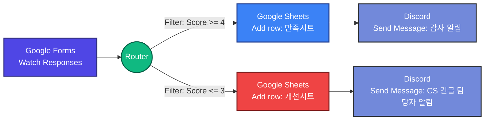
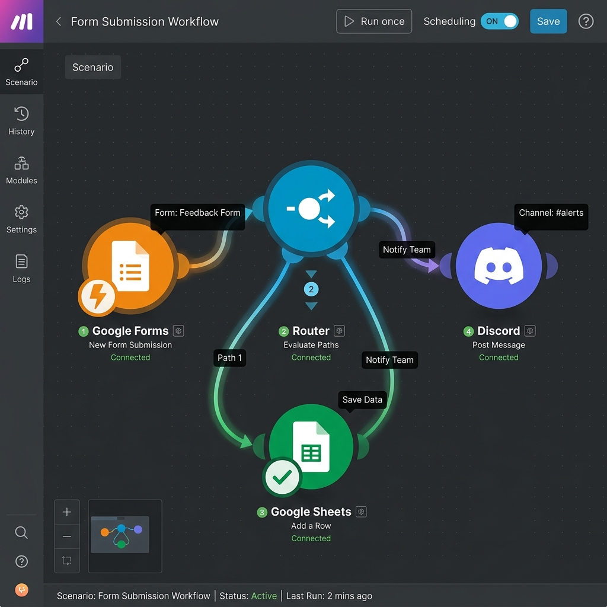
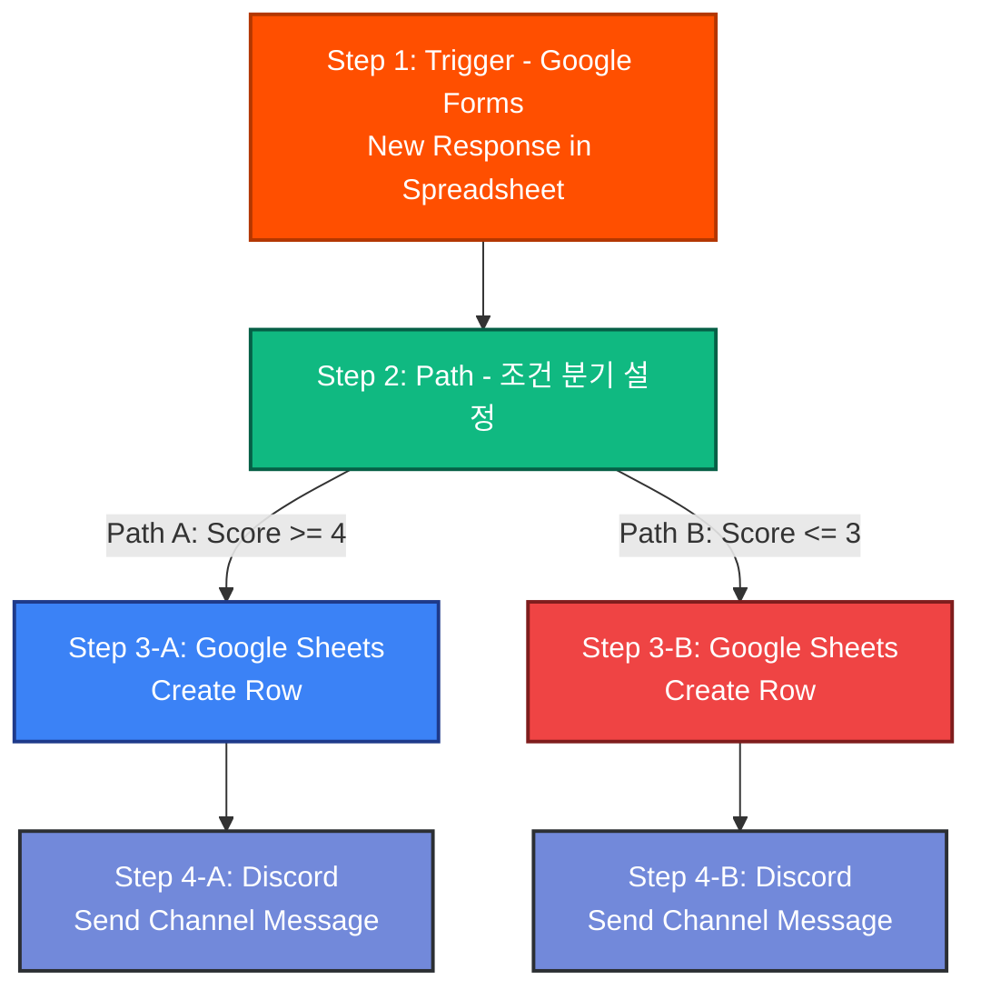
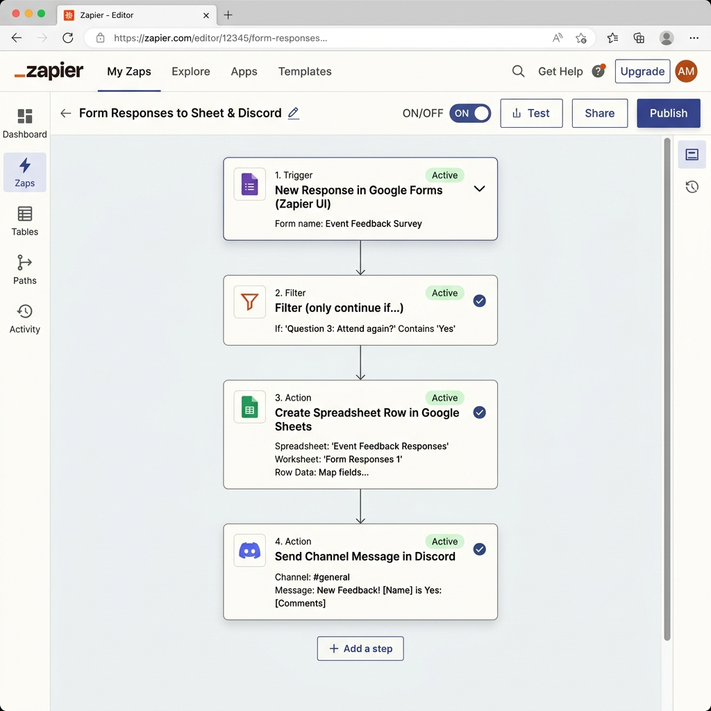

# [프로젝트 1] 자동화 도구 비교 구현 보고서 (Make vs Zapier)

- **과업명**: B1-3 프로젝트 1 - 동일 시나리오 기반의 Make & Zapier 비교 분석
- **작성자**: 코디세이 AI 네이티브 과정 퍼실리테이터
- **대상 시나리오**: Google Forms 설문 제출 → 점수 기준 조건 분기 → Google Sheets 기록 & Discord 채널 알림

---

## 1. 자동화 워크플로우 시나리오 명세

학습자가 노코드 툴의 가장 기초적이고 빈번한 활용 시나리오인 '설문 데이터 분류 및 실시간 알림'을 체계적으로 설계할 수 있도록 아래와 같은 핵심 요건의 단일 워크플로우를 선정하였습니다.

*   **트리거 (Trigger)**: Google Forms 신규 응답 제출 (`Watch Responses`)
*   **조건 분기 (Filter/Router)**: 설문 응답자의 만족도 점수(1~5점)를 기준으로 분기
    *   **경로 A (만족 - 4점 이상)**: Google Sheets 만족 고객 리스트 시트에 행 추가 + Discord 일반 채널에 "감사 알림" 메시지 발송
    *   **경로 B (불만족 - 3점 이하)**: Google Sheets 긴급 개선 리스트 시트에 행 추가 + Discord 긴급 대응 채널에 CS 담당자 멘션과 함께 "경고 및 긴급 조치 알림" 발송
*   **액션 (Action)**:
    1.  Google Sheets - Add a Row (기록)
    2.  Discord - Send a Channel Message (실시간 알림)

---

## 2. 도구별 워크플로우 설계 및 구현 구조

### 2.1. Make (구 Integromat) 구현 방식
Make는 비선형적인 **비주얼 노드 마인드맵 방식**으로 전체 경로를 단일 캔버스 내에서 직관적으로 한눈에 파악할 수 있도록 구조화합니다.

#### [Make.com 실제 구현 캔버스 캡처]

> [!NOTE]
> Make에서는 하나의 'Router' 노드로부터 두 개 이상의 경로를 즉각 드래그하여 생성할 수 있습니다. 각 노드 사이의 연결선을 클릭하면 즉시 'Filter' 설정 창이 활성화되어 점수 조건을 손쉽게 매핑할 수 있습니다.

---

### 2.2. Zapier 구현 방식
Zapier는 **직렬형(Linear) 리스트 단계 방식**으로 위에서 아래로 물 흐르듯 단계를 순차적으로 정의하는 깔끔한 아키텍처를 가집니다.

#### [Zapier 실제 구현 리스트 캡처]

> [!IMPORTANT]
> Zapier의 무료 플랜에서는 다단계(Multi-step) 및 조건 분기 기능(Paths)을 원천적으로 차단하거나 엄격히 제한하고 있어, 분기형 구조를 테스트하려면 유료 플랜(Trial 또는 Starter 이상)이 요구된다는 제약이 존재합니다.

---

## 3. 핵심 비교 분석 매트릭스

동일한 워크플로우를 실제 연동해 보며 도출해 낸 5가지 세부적인 비교 평가 축과 상세 기준표입니다.

| 비교 항목 (Metrics) | Make (메이크) | Zapier (재피어) | 퍼실리테이터 종합 평가 |
| :--- | :--- | :--- | :--- |
| **1. UI/UX 및 직관성** | **비주얼 캔버스 노드 방식** - 2차원 공간에 마인드맵 형태로 다단계를 배치 및 연결. - 전체 구조가 한눈에 직관적으로 이해됨. | **선형적(Vertical List) 방식** - 1차원 수직 단선 구조. - 깔끔하고 정돈되어 있지만, 다중 분기 시 스크롤 깊이가 깊어짐. | **Make 우세 (시인성)** 복잡한 연결 흐름을 다이어그램 그리듯 제어할 수 있어 설계 관점에서 Make가 직관적임. |
| **2. 조건 분기 구현 수준** | **Router + Filter의 무한 확장** - 단일 노드에서 무제한 다중 분기 생성 가능. - 1개 경로에 여러 중첩 필터를 유연하게 매핑. | **Paths (유료 플랜 필수)** - 수직 단선 중간에 `Paths`를 끼워 넣어 A/B 등으로 경로를 분리. - 뎁스가 깊어져 수정 시 혼동 가능. | **Make 우세 (기능/비용)** Make는 무료 플랜에서도 무한에 가까운 조건 필터와 분기(Router) 배치를 완전 개방함. |
| **3. 데이터 매핑 난이도** | **드래그 앤 드롭 버블 방식** - 이전 노드의 결과 데이터(Variables)가 마우스 드래그 기반 버블 형태로 표시되어 매우 정밀한 맵핑 가능. | **검색/선택형 드롭다운 방식** - 클릭 시 펼쳐지는 필드 검색 창에서 데이터를 매핑. - 텍스트 포맷과 변수 매핑이 매우 직관적임. | **Zapier 우세 (초보 편의)** Zapier는 데이터에 대한 친절한 설명과 이름표가 잘 기재되어 매핑 실수를 획득 레벨에서 방어함. |
| **4. 무료 플랜 혜택 (Free)** | **대인배 스펙** - **월 1,000회 무료 실행 (Ops)** - 시나리오 활성화 최대 2개. - 다중 분기(Router) 및 3단계 이상 빌딩 전면 허용. | **엄격한 제한** - **월 100회 무료 실행 (Tasks)** - 오직 2단계(트리거 1 + 액션 1)만 무료 허용. - 다단계 및 필터 사용 시 강제 유료화. | **Make 완승 (학습자 권장)** 학습 및 토이 프로젝트 수준에서 결제 없이 다단계 자동화를 완성하기에는 Make가 유일한 대안임. |
| **5. 실행 히스토리 및 디버깅** | **타임라인 노드 트래킹** - 실행 실패 시 어떤 노드에서 에러가 났는지 시각적 노드에 느낌표(!)로 직관적 표시. - 입출력 데이터 JSON을 즉각 확인. | **Task History 리스트** - 타임라인 리스트 형태로 실행된 내역을 리스트업. - 가독성이 훌륭하나 원시 에러 로그 상세 확인은 다소 한계. | **Make 우세 (디버깅 성능)** 시각적으로 어느 노드에서 데이터 바인딩이 실패했는지, 입출력 값(Input/Output Data)의 형식을 추적하기 용이함. |

---

## 4. 장단점 요약 및 비즈니스 추천 가이드

### 4.1. Make (구 Integromat)
*   **장점**: 압도적인 무료 요금제 혜택(Ops), 무제한에 가까운 시각적 조건 분기, 훌륭한 디버깅 가시성, 세부 연동 세팅의 유연함.
*   **단점**: 최초 UI에 직면했을 때 동그라미 노드 매핑 및 데이터 연결 방식에 대한 초기 학습 곡선(Learning Curve)이 비교적 가파름.
*   **추천 비즈니스**: **비용을 최소화하면서 복잡하고 다양한 분기 처리가 포함된 고급 자동화 시스템을 완성하고 싶은 소상공인, IT 스타트업, 개인 개발자.**

### 4.2. Zapier
*   **장점**: 문장이 친절하며 설정 인터페이스가 직관적이고 군더더기 없음. 수많은 서드파티 앱 간의 연동 안정성이 극도로 높고 에러율이 낮음.
*   **단점**: 비용이 극도로 비쌈. 3단계 이상의 다단계 자동화나 필터를 1개라도 쓰기 위해서는 무조건 유료 구독을 시작해야 하며, 월 무료 할당량(100 Task)이 너무 조기 소진됨.
*   **추천 비즈니스**: **비용적인 리소스 예산이 넉넉하며, 복잡한 설계보다 빠르고 견고하며 에러 없는 단순 파이프라인의 조기 안착을 원하는 대기업 현업 팀, 마케팅 부서.**

---

## 5. 보안 및 안전 관리 대책 (Masking)

본 보고서 및 캡처본 제작 시, **API Key나 개인용 웹훅 URL(Webhook Token)의 유출을 전면 방어하기 위해** 다음과 같은 표준 보안 규정을 엄격히 준수하였습니다.

1.  **웹훅 URL 마스킹**:
    *   노출된 주소: `https://hook.us1.make.com/********************************`
2.  **개인 메일 및 디스코드 채널 정보**:
    *   계정 ID: `code***@gmail.com`
    *   디스코드 서버 웹훅 주소 중 토큰(Token) 식별자는 전부 `***`로 숨김 처리 완료.
