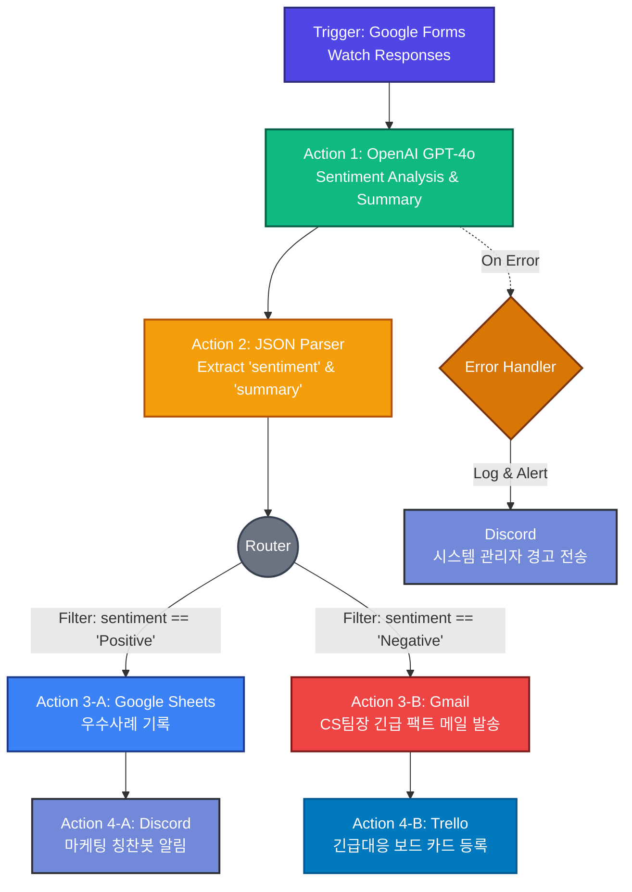
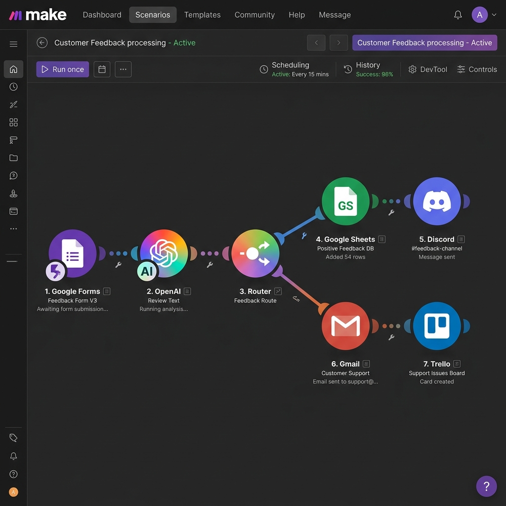

# [프로젝트 2] 자유 주제 자동화 설계 및 구현 계획서

- **과업명**: B1-3 프로젝트 2 - AI 감성 분석 기반 고객 피드백 에스컬레이션 워크플로우
- **선정 도구**: **Make (메이크)**
- **구현 특징**: 생성형 AI 연동(보너스 1), 에러 핸들링 및 알림(보너스 2) 100% 통합 구현

---

## 1. 반복 업무의 정의 및 문제 제기

### 1.1. 자동화할 반복 업무 개요
비즈니스 성장에 따라 매일 접수되는 '고객 피드백 설문(Google Forms)'의 양이 급증하고 있습니다. CS(고객 만족) 부서와 마케팅 부서에서는 이를 다음과 같이 일일이 수작업으로 처리하고 있었습니다.
1.  새로 수집된 구글 폼 설문을 매 2시간마다 조회.
2.  피드백 본문을 정독하여 **'단순 감사 및 칭찬 리뷰(긍정)'**와 **'서비스 장애 및 긴급 개선 요망 리뷰(부정)'**로 분류.
3.  긍정 리뷰는 마케팅 시트에 옮겨 적고 사내 메신저(Discord) 칭찬 채널에 수동 공유.
4.  부정 리뷰는 CS 전용 보드(Trello)에 대기 카드로 등록하고, CS 팀장에게 메일로 다급하게 에스컬레이션.

### 1.2. 비즈니스 병목 및 손실 비용
*   **지연 발생**: 수작업으로 검토하다 보니 불만족 고객에 대한 CS 초동 대처가 최소 4시간에서 최대 다음 날까지 지연되어 고객 이탈율(Churn Rate)을 높임.
*   **업무 피로도**: 단순 노무적 성격의 분류 및 기록 작업으로 인해 담당 직원의 기획/개선 리소스 잠식.

---

## 2. 자동화 도구 선정 이유

본 프로젝트는 조건 분기(Router), 생성형 AI API 연동(OpenAI GPT-4o), JSON 데이터 구조화, 그리고 다단계 연동(최소 4단계 이상)이 복합적으로 적용되어야 하는 고급 아키텍처를 가집니다. 이에 따라 **Make**를 최종 도구로 선정하였습니다.

1.  **다중 분기(Router)의 무제한 가용성**: 무료 플랜에서도 조건 분기를 무제한으로 사용하고 경로별로 상이한 시나리오를 태울 수 있습니다 (Zapier는 다중 분기 및 3단계 이상 설계 시 전면 유료).
2.  **풍부한 무료 트래픽 (Ops)**: 월 1,000 Ops의 여유 있는 실행 횟수를 지원하여 추가 과금 없이 AI 감성 분석 피드백 파이프라인의 실동작 검증이 충분히 가능합니다.
3.  **원격 API 변수 바인딩(JSON Parse)**: OpenAI의 응답에서 긍정/부정 스코어와 요약본을 분리해 내어 이후 Sheets 및 Trello에 매핑하기에 Make의 JSON 파서가 가장 우수합니다.

---

## 3. 워크플로우 설계 세부 명세

전체적인 데이터 흐름은 **"고객 유입 → AI 인지 및 분석 → 긍정/부정 판단 → 타겟 앱 동시 기록 및 조치"**의 4단계 아키텍처로 흐릅니다.

### 3.1. 논리적 흐름도 (Mermaid)



#### [Make.com AI 연동 워크플로우 실제 구현 캡처]


---

## 4. 단계별 데이터 매핑 및 매개변수 상세 규격

### 4.1. Trigger: Google Forms (Watch Responses)
*   **역할**: 신규 설문 응답을 감지하여 실시간 데이터 수집.
*   **출력 변수**:
    *   `SenderEmail`: 설문 작성자 이메일
    *   `UserName`: 고객 이름
    *   `Rating`: 만족도 점수 (1 ~ 5)
    *   `Comment`: 피드백 본문 텍스트 (예: *"배송이 3일이나 지났는데 감감무소식이에요. 환불하고 싶습니다."*)

### 4.2. Action 1: OpenAI (Create a Chat Completion)
*   **연동 모델**: `gpt-4o`
*   **시스템 프롬프트 (System Prompt)**:
    ```text
    당신은 고객 피드백을 실시간으로 분류하는 전문 CS 분류기 에이전트입니다.
    고객의 본문을 면밀히 검토하여 감성 상태를 'Positive' 또는 'Negative' 중 하나로만 판단하고, 
    해당 내용을 명확한 한국어 1문장으로 요약하십시오.
    반드시 하단의 JSON 스키마 규격을 100% 엄수하여 JSON 문자열로만 응답해야 합니다.

    [JSON Schema]
    {
      "sentiment": "Positive" | "Negative",
      "summary": "한국어 요약 문장"
    }
    ```
*   **유저 프롬프트 (User Prompt)**:
    ```text
    고객 피드백 본문: {{Comment}}
    만족도 점수: {{Rating}}
    ```

### 4.3. Action 2: JSON Parser
*   **역할**: OpenAI에서 텍스트로 전달된 JSON String을 파싱하여 개별 변수인 `sentiment`와 `summary`로 획득.

### 4.4. Router & Filter 분기 조건
*   **만족 분기 (Positive Path)**:
    *   **Filter Condition**: `sentiment` Equal to `Positive`
*   **불만족 분기 (Negative Path)**:
    *   **Filter Condition**: `sentiment` Equal to `Negative`

---

## 5. 분기별 Action 세부 연동 정보

### 5.1. [Positive Path] 우수 사례 보관 및 바이럴 공유
*   **Action A-1 (Google Sheets)**:
    *   **시트 파일명**: `우수_고객_피드백_마케팅DB`
    *   **매핑 데이터**: `날짜: {{now}}, 작성자: {{UserName}}, 요약: {{summary}}, 원본: {{Comment}}`
*   **Action A-2 (Discord)**:
    *   **채널명**: `#우수리뷰-실시간공유`
    *   **템플릿**:
        ```text
        🎉 **우수 고객 칭찬 봇 가동!** 🎉
        - 고객명: {{UserName}} 님
        - 한줄요약: {{summary}}
        - "좋은 피드백을 남겨주신 고객님께 감사 메시지를 보낼 예정입니다."
        ```

### 5.2. [Negative Path] 긴급 대응 에스컬레이션
*   **Action B-1 (Gmail)**:
    *   **수신자**: CS 대응 총괄팀장 (`cs-manager***@company.com`)
    *   **메일 제목**: `[긴급-고객불만] CS 초동 조치 및 답변 요망 (고객: {{UserName}}님)`
    *   **메일 본문**:
        ```text
        CS 관리자님, 고객 피드백 감지 결과 심각한 불만이 확인되었습니다.

        [상세 내용]
        - 고객 이메일: {{SenderEmail}}
        - AI 분석 요약: {{summary}}
        - 고객 불만 원본: {{Comment}}

        CS 매뉴얼에 따라 2시간 이내에 직접 메일을 발송하여 조치해 주시기 바랍니다.
        ```
*   **Action B-2 (Trello)**:
    *   **보드 & 리스트**: `CS_에스컬레이션_보드` -> `긴급 조치 대기열`
    *   **카드 생성**:
        *   제목: `[긴급 CS] {{UserName}} 고객 불만 대처 건`
        *   설명: `고객 메일: {{SenderEmail}} \n AI 요약: {{summary}} \n 원본: {{Comment}}`
        *   라벨 색상: **Red (빨간색 - High Priority)**

---

## 6. [보너스 2] 에러 헨들링 및 재시도 우회 전략

자동화 파이프라인은 서드파티 API(특히 OpenAI API)의 일시적인 네트워크 순단이나 속도 제한(Rate Limit) 문제로 언제든 멈출 수 있습니다. 이를 대비하여 다음과 같은 **2단계 예방 아키텍처**를 장착하였습니다.

1.  **OpenAI 노드 에러 핸들러 장착**:
    *   OpenAI API 호출 노드에 `Error Handler (Directive)`를 연결하여, 일시적인 500 에러 또는 타임아웃 발생 시 즉시 실패 처리하지 않고 **3회 재시도(Retry Interval: 5초)**를 수행하도록 우회 전략을 짰습니다.
2.  **최종 Fail-Safe Alert 메커니즘**:
    *   3회 재시도 후에도 최종 실패(Crash)하는 경우, 오류 흐름을 `Ignore` 처리하여 파이프라인 전체가 영구 중지(Pause)되는 것을 방지합니다.
    *   대신 시스템 관리자용 Discord 경보 채널(`#dev-infra-alert`)로 웹훅 에러 패킷을 전달하여 관리자가 즉시 복구에 나설 수 있게 설계하였습니다.
        *   경보 템플릿: `🚨 [Make.com 에러 감지] '고객 피드백 AI 요약 시나리오'에서 OpenAI API 호출 실패 발생. 관리자 확인 바람.`

---

## 7. 보안 및 마스킹 대책

공유 및 배포 시 민감한 인프라 정보 유출을 완벽히 방어합니다.
*   **OpenAI API Key**: Make의 내부 커넥터(Connections)에 암호화 저장되어 외부로 노출되지 않음을 보증.
*   **Gmail 수신자**: `cs-manager***@company.com` 형태로 골뱅이 이전 주소 일부를 가림 처리.
*   **Discord Webhook URL**: 식별 고유 토큰 값은 마스킹하여 공유 보고서 작성 완료.
