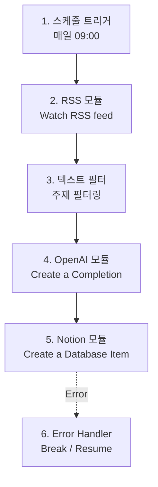

# 뉴스 요약 자동화 워크플로우 명세서

이 문서는 Make(Make.com)를 활용하여 AI 및 최신 IT 기술 동향 뉴스를 수집하고, 요약하여 노션에 자동 저장하는 워크플로우의 전체 구조와 설정 정보를 안내합니다. 보너스 요건(썸네일/감성분석)은 제외하고 핵심 파이프라인에 집중합니다.

## 전체 워크플로우 구조도 (개념도)

## 모듈별 상세 설정 가이드

### [1] 스케줄 트리거 (Make 기본 트리거)
- **실행 주기**: 매일 (Every day)
- **실행 시간**: 09:00 AM
- **타임존**: Asia/Seoul

### [2] RSS 데이터 수집 (RSS - Watch RSS feed)
- **URL**: 선택한 AI/IT 뉴스 피드 (예: `https://news.ycombinator.com/rss` 등)
- **Limit**: 한 번에 가져올 기사의 수 (예: 10개)
- **동작**: 새로 업데이트된 피드 항목의 제목(Title), 설명(Description), 링크(URL), 발행일시(Date)를 가져옵니다.

### [3] 데이터 필터링 (Make Filter)
- **위치**: RSS 모듈과 OpenAI 모듈 사이의 연결 선(Router/Link)에 필터 아이콘 클릭
- **조건 (Condition)**: `Title` 또는 `Description` 내에 특정 키워드가 포함된 경우 통과 (예: "AI", "Agent", "LLM" 등)
- **제한 설정**: Make의 **Sleep**이나 추가 변수 모듈을 활용하거나 1건만 통과하도록 상태 플래그를 두어 `하루 1건 처리`를 달성합니다. (Limit 1 활용)

### [4] AI 가공 (OpenAI - Create a Completion / Chat Completion)
- **Model**: `gpt-4o-mini` 또는 `gpt-3.5-turbo`
- **Messages / Prompt**:
  - **System**: "당신은 IT 전문 기자입니다. 주어진 기사 본문을 파악하여 핵심 내용만 3줄의 글머리 기호(- )로 요약하세요."
  - **User**: "제목: {{Title}}\n내용: {{Description}}\n링크: {{URL}}\n이 기사를 3줄 이내로 요약해 주세요."
- **요출 정책**: 기사 1건당 1회 원칙 (재시도 발생 시에만 추가 호출).

### [5] 자동 저장 (Notion - Create a Database Item)
- **Database ID**: 설정한 노션 데이터베이스 선택
- **속성 매핑(Mapping)**:
  - **제목 (Title)**: RSS 모듈의 `Title`
  - **요약문 (Rich Text)**: OpenAI 모듈의 `Choices[0].Message.Content` (AI 요약 결과)
  - **원문 링크 (URL)**: RSS 모듈의 `URL`
  - **발행일시 (Date)**: RSS 모듈의 `Date`
  - **중복 방지 키 (Text)**: RSS 모듈의 `URL` (또는 `GUID`). 노션 모듈 설정 전 'Search Objects'로 이미 존재하는지 조회 후 진행하는 필터를 추가하면 중복 생성을 원천 차단할 수 있습니다.

### [6] 예외 처리 (Error Handling)
- **위치**: Notion 또는 OpenAI 모듈에 마우스 우클릭 -> `Add error handler`
- **모듈**: **Break** 모듈 사용
  - **동작**: 오류 발생 시 **최대 2회 재시도 (Number of retries: 2)**. 그 이후에도 실패하면 실행을 스킵하고 프로세스를 무시(Ignore)합니다.
  - 이를 통해 무한 루프를 방지하고 불필요한 API 호출 비용을 차단합니다.
