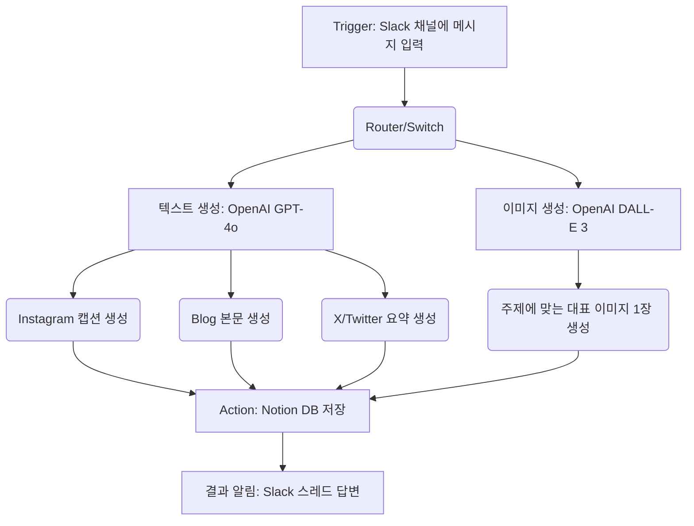

# 자동화 워크플로우 아키텍처

이 문서는 Slack에서 주제를 입력받아 AI(OpenAI)로 소셜 미디어 플랫폼별 맞춤형 텍스트와 이미지를 생성하고, Notion 데이터베이스에 저장하는 전체 파이프라인의 구조를 설명합니다. 이 구조는 Make(Integromat) 또는 Zapier와 같은 노코드 툴을 활용하여 구현할 수 있습니다.

## 1. 워크플로우 파이프라인 구조

## 2. 각 단계별 역할 설명

### 단계 1: 입력 및 트리거 (Slack)
- **도구**: Slack (Make/Zapier Trigger)
- **동작**: 특정 채널(예: `#콘텐츠-생성봇`)에 지정된 명령어 포맷(예: `!콘텐츠생성 2025년 AI 트렌드`)을 입력하면 워크플로우가 시작됩니다.
- **역할**: 주제(Topic) 텍스트를 파싱하여 후속 AI 모듈에 프롬프트 변수로 전달합니다.

### 단계 2: AI 콘텐츠 생성 (OpenAI)
이 단계는 텍스트와 이미지를 동시에(병렬) 처리하거나 순차적으로 처리합니다.

- **텍스트 모듈 (GPT-4o)**
  - 슬랙에서 받은 주제를 기반으로 3개의 각기 다른 시스템 프롬프트를 호출하여 인스타그램, 블로그, X용 텍스트를 생성합니다. (각 플랫폼별 API 콜을 분리하거나 JSON 형태로 한 번에 응답받도록 설계)
- **이미지 모듈 (DALL-E 3)**
  - 입력받은 주제를 시각화하기 적합한 이미지 생성 프롬프트로 변환한 뒤 DALL-E 3 API를 호출하여 대표 이미지 URL을 생성합니다.

### 단계 3: 결과 저장 (Notion)
- **도구**: Notion (Make/Zapier Action)
- **동작**: 생성된 결과값들을 Notion 데이터베이스의 새로운 페이지로 생성합니다.
- **저장 구조**: 
  - 플랫폼마다 독립된 페이지를 생성하는 대신, **하나의 데이터베이스에서 속성(Properties)**을 이용해 각 플랫폼의 텍스트와 이미지를 저장하고 `View`를 통해 플랫폼별로 필터링하여 봅니다.

### 단계 4: 알림 (Slack)
- **도구**: Slack (Make/Zapier Action)
- **동작**: Notion 저장에 성공하면 처음 명령어를 입력한 Slack 메시지의 스레드(Thread)로 `[생성 완료! Notion에서 결과를 확인하세요: 링크]` 메시지를 반환하여 작업 종료를 알립니다.
